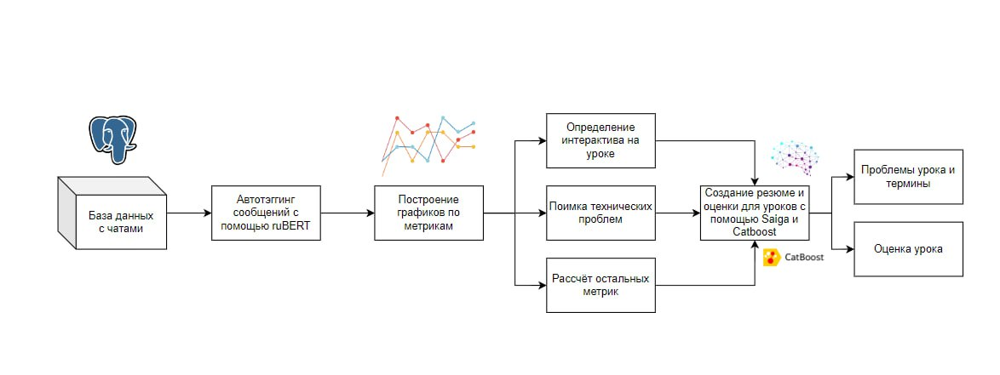
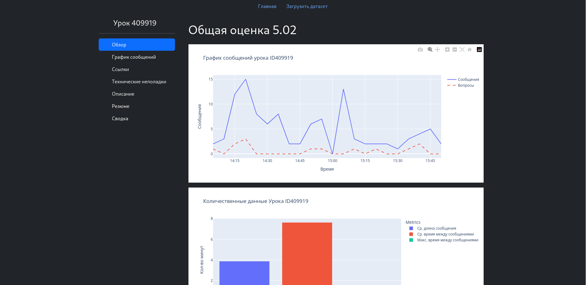
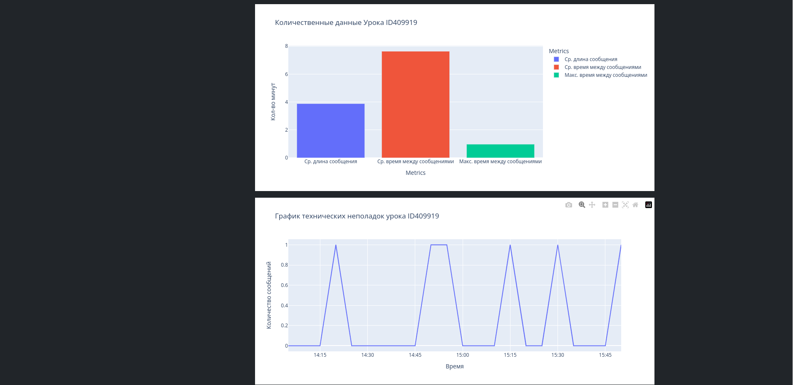
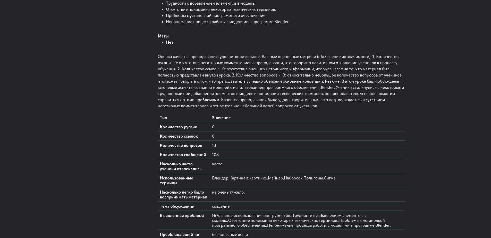

# 
 Анализ качества преподавания 

Состав команды "Альянс Щёлково и Раменки"   
*   Павлов Кирилл (https://github.com/Papr1ka) - Backend, Frontend, DevOps     
*   Рапопорт Юлия (https://github.com/WannaSleepBadly) - ML-engineer 
*   Калмыков Александр (https://github.com/SaSniyKex) - ML-engineer 
*   Капитонова Софья (https://github.com/sokkop) - ML-engineer 
*   Сариков Тимур (https://github.com/holopyolo) - ML-engineer 

## Задание

Необходимо создать инструмент, который позволит производить быстрый и автоматизированный
анализ данных, основанный на чате урока.

## Решение

Алгоритм нашего решения имеет следующий вид:
1. Присвоение тэгов сообщениям с помощью ruBERT;
2. Просчёт выбранных метрик, составление по ним графиков;
3. Использование предобученной языковой модели Saiga для получения отзыва на проведённый урок;
4. Просчёт оценки урока с помощью полученных метрик и модели Catboost;
5. Составление итогового отчёта по уроку с помощью данных от Saiga.

Для взаимодействия с созданной моделью используется сайт и десктопная программа.

Доступна загрузка датасета

### Принцип работы системы оценивания

### Киллер-фичи

1. Автотэггинг, анализ чата, визуальной отображение его настроения
2. Вывод списка сайтов, которые упоминались в чате
3. Создание текстовых отчётов и гипотез по каждому уроку
4. Загрузка собственного датасета позволяет легко запустить код на сервере

### Скринкаст

<video src="./video.mp4" width="320" height="240" controls></video>

## Уникальность нашего решения

- Создание кастомных тэгов;
- Выводы о поведении чата сделанные с помощью математической статистики;
- Сохранение результатов обработки уроков в базу данных для быстрой загрузки при следующем просмотре;
- Создание сложных выводов с помощью языковой модели;
- Удобный и понятный интерфейс десктопной программы и сайта.

## Использованный стек:
- Библиотеки pyTorch, numpy, transformers,  pandas;
- Docker, Django, Celery, JavaScript

## Запуск

1. `cd ta && docker compose up`
2. `python -m pip install -r requirements.txt`
3. `cd ta && python manage.py makemigrations && python manage.py migrate`
4. Установите DATA переменную окружения равной пути к папке, содержащей файлы:
- best_mode_happy.bin
- best_model_state.bin
- Complete Russion badwords dictionary
- final
- model-q4_K.gguf
5. `python manage.py runserver`
6. `celery -A taapp.celery worker -P solo -l info`

## Интерфейс

## Презентация

[Доступна здесь](./presentation.pdf)
